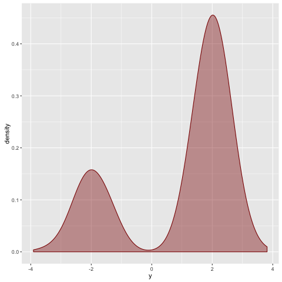
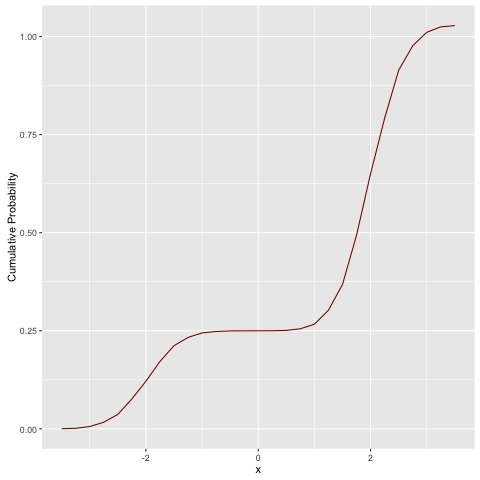
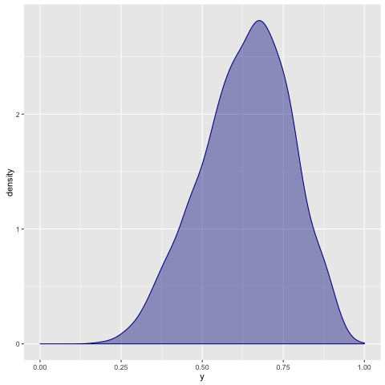

# deanie

[](https://github.com/jtobin/deanie/blob/master/LICENSE)

*deanie* is an embedded probabilistic programming language.  It can be used to
denote, sample from, and perform inference on probabilistic programs.

## Usage

Programs are written in a straightforward monadic style:

``` haskell
mixture :: Double -> Double -> Program Double
mixture a b = do
  p      <- beta a b
  accept <- bernoulli p
  if   accept
  then gaussian (negate 2) 0.5
  else gaussian 2 0.5
```

You can sample from them by first converting them into an *RVar* from
[random-fu][rafu]:

```
> sample (rvar (mixture 1 3))
```

Sample many times from models using standard monadic combinators like
'replicateM':

```
> replicateM 1000 (sample (rvar (mixture 1 3)))
```



Or convert them to measures using a built-in interpreter:

```
> let nu = measure (mixture 1 3)
> let f = cdf nu
```



You can perform inference on models using rejection or importance sampling, or
use a simple, stateful Metropolis backend.  Here's a simple beta-bernoulli model
conditioned on the provided observations:

``` haskell
betaBernoulli :: Double -> Double -> Program Bool
betaBernoulli a b = do
  p <- beta a b
  bernoulli p

observations :: [Bool]
observations = [True, True, False, True, False, False, True, True, True]
```

Here's one way to encode a posterior via rejection sampling:

``` haskell
rposterior :: Double -> Double -> Program Double
rposterior a b =
    grejection
      (\xs ys -> count xs == count ys)
      observations (beta a b) bernoulli
  where
    count = length . filter id
```



Here's another, via importance sampling:

``` haskell
iposterior :: Double -> Double -> Program (Double, Double)
iposterior a b =
  importance observations (beta a b) logDensityBernoulli
```

There are also some Monte Carlo convenience functions provided, such as a
weighted average for weighted samples returned via importance sampling:

```
> samples <- replicateM 1000 (sample (rvar (iposterior 1 1)))
> print (mcw samples)
0.6369246537796793
```

## Background

You can read about some of the theory and ideas behind this kind of language in
some blog posts I've written.

* [Encoding Statistical Independence, Statically][enco]
* [A Simple Embedded Probabilistic Programming Language][sppl]
* [Comonadic MCMC][como]
* [Foundations of the Giry Monad][gifo]
* [Implementing the Giry Monad][gimp]
* [The Applicative Structure of the Giry Monad][giap]

[giap]: /giry-monad-applicative
[gimp]: /giry-monad-implementation
[gifo]: /giry-monad-foundations
[enco]: /encoding-independence-statically
[sppl]: /simple-probabilistic-programming
[como]: /comonadic-mcmc
[rafu]: https://hackage.haskell.org/package/random-fu

